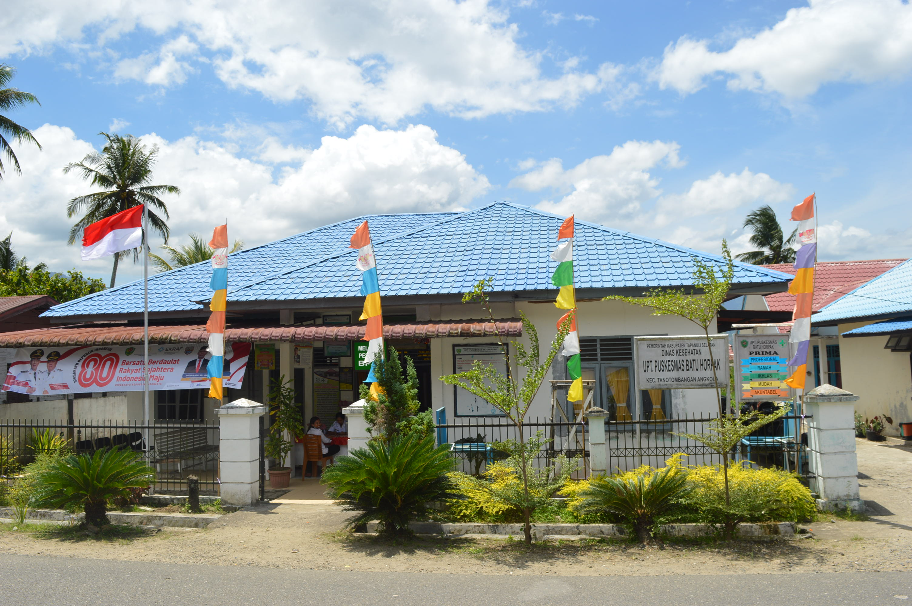
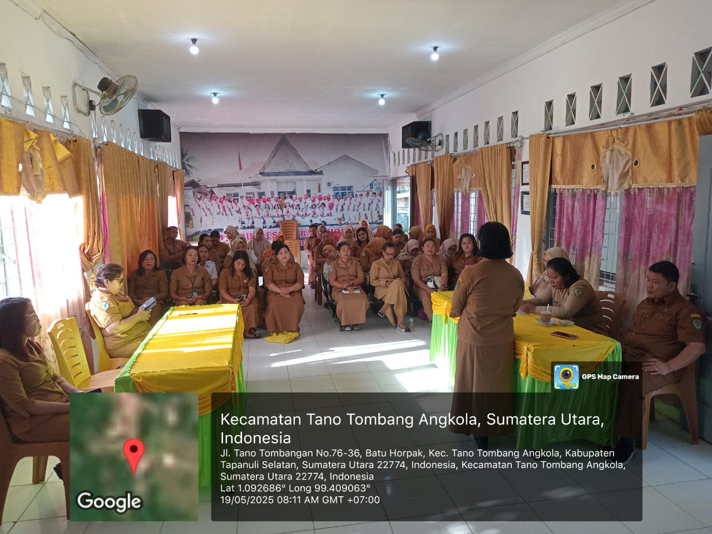
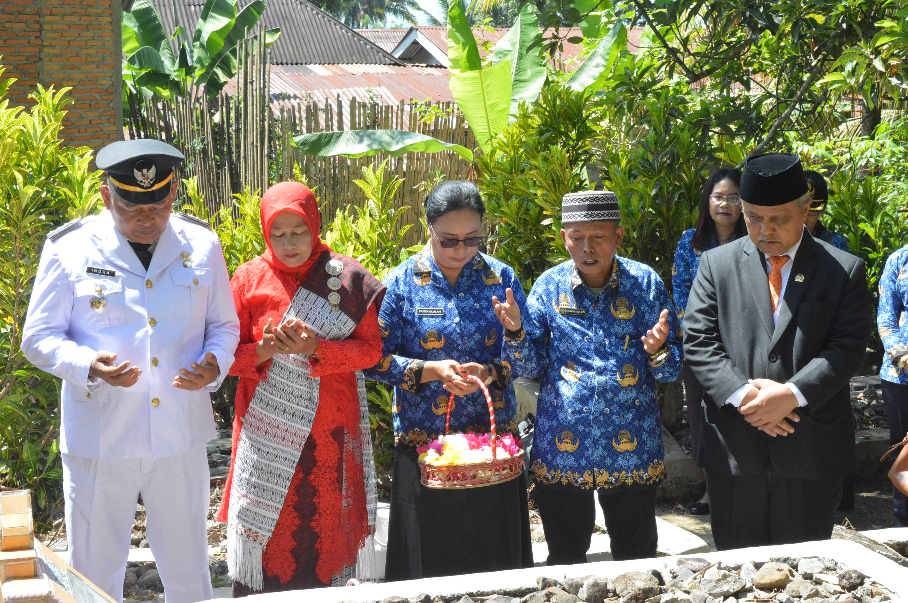

<!DOCTYPE html>
<html lang="id">
<head>
    <meta charset="UTF-8">
    <meta name="viewport" content="width=device-width, initial-scale=1.0">
    <link rel="stylesheet" href="style.css">
</head>
<body>
    <header>
        

            

                
                <h1>Puskesmas Batu Horpak</h1>
            

            <nav>
                <ul>
                    <li><a href="#beranda">Beranda</a></li>
                    <li><a href="#profil">Profil</a></li>
                    <li><a href="#layanan">Layanan</a></li>
                    <li><a href="#jadwal">Jadwal</a></li>
                    <li><a href="#kontak">Kontak</a></li>
                </ul>
            </nav>
        

    </header>

    <section id="beranda" class="hero">
        

            <h2>Selamat Datang di Website Resmi Puskesmas Batu Horpak</h2>
            
Melayani dengan Hati, Menuju Masyarakat Tano Tombangan Angkola yang Sehat

            
            
            
            
    </section>

    <section id="profil" class="info">
        

            <h2>Profil Puskesmas Batu Horpak</h2>
            
Puskesmas Batu Horpak adalah unit pelaksana teknis dinas kesehatan di Kecamatan Tano Tombangan Angkola, Kabupaten Tapanuli Selatan. Kami berkomitmen untuk memberikan pelayanan kesehatan primer yang berkualitas dan terjangkau bagi seluruh masyarakat.

            <h3>Visi</h3>
            
"Menjadi puskesmas batu horpak dengan pelayanan prima menuju masyarakat tano tombangan angkola yang sehat."

            <h3>Misi</h3>
            <ul>
                <li>Memberikan pelayanan kesehatan yang paripurna dan profesional.</li>
                <li>Meningkatkan kesadaran masyarakat akan pentingnya hidup sehat.</li>
                <li>Menggerakkan pembangunan berwawasan kesehatan di wilayah kerja.</li>
            </ul>
        

    </section>

    <section id="layanan" class="services">
        

            <h2>Layanan Kami</h2>
            

                

                    <h3>Poli Umum</h3>
                    
Pelayanan pemeriksaan kesehatan umum untuk segala usia.

                

                

                    <h3>Kesehatan Ibu dan Anak (KIA) & KB</h3>
                    
Pemeriksaan kehamilan, imunisasi, dan layanan keluarga berencana.

                

                

                    <h3>Posyandu</h3>
                    
Kegiatan rutin untuk memantau tumbuh kembang balita dan kesehatan ibu hamil.

                

                

                    <h3>Poli Gigi</h3>
                    
Pelayanan kesehatan gigi dan mulut dasar.

                

                

                    <h3>Konseling Gizi</h3>
                    
Konsultasi untuk pemenuhan gizi seimbang .

                

                 

                    <h3>Laboratorium Sederhana</h3>
                    
Pemeriksaan penunjang dasar untuk membantu penegakan diagnosis.

                

            

        

    </section>

    <section id="jadwal" class="schedule">
        

            <h2>Jadwal Pelayanan</h2>
            
<strong>Jam Operasional Puskesmas:</strong>

            
Senin - Sabtu: 08:00 - 14:30

            
<strong>Pendaftaran Pasien:</strong>

            
Senin - Sabtu: 08:00 - 14:30

        

    </section>

    <section id="kontak" class="contact">
        

            <h2>Hubungi Kami</h2>
            
<strong>Alamat:</strong>

            
Desa Batu horpak, Kecamatan Tano Tombangan Angkola, Kabupaten Tapanuli Selatan, Sumatera Utara, 22774

            
<strong>Telepon:</strong> 085275068796

            
<strong>Email:</strong> uptpuskesmasbatuhorpak@gmail.com

        

    </section>

    <footer>
        

            
&copy; 2025 Puskesmas Batu Horpak. Hak Cipta Dilindungi.

        

    </footer>
</body>
</html>
